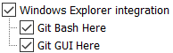
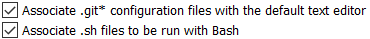
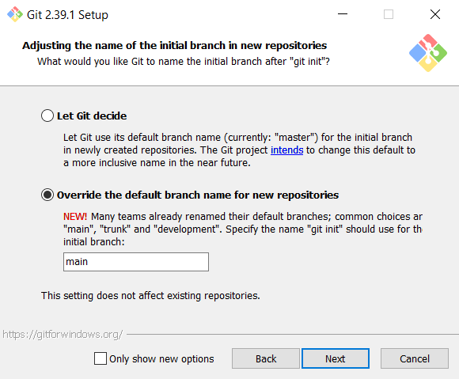
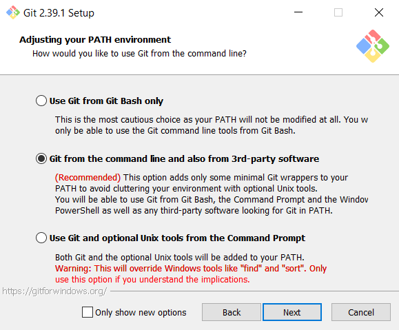

# Tuto Installation/Utilisation Git et Github

   

Ceci est un fichier markdown, si vous êtes dans un IDE, activez la visualisation "Preview" en haut à droite de la fenêtre. 
Vous pouvez aussi lire ce fichier directement sur GitHub [ici](https://github.com/Leroymilo/tuto_git/blob/main/README.md).

## Installation de Git

Git est un logiciel de gestion de versions de projets, pas besoin de faire des V0, des V1 et des V2, Git gère tout, même les modifications en parallèle.

### Windows :
- Téléchargez git [ici](https://github.com/git-for-windows/git/releases/download/v2.39.1.windows.1/Git-2.39.1-64-bit.exe)
- Lancez l’installateur téléchargé
- Sélectionnez les options suivant ce qui est indiqué dans la prochaine partie
- Les onglets qui ne sont pas mentionnés doivent être laissés avec les options par défaut

### Mac :
Installez git en suivant les instructions trouvées [ici](https://git-scm.com/download/mac) (une des 2 premières options)

## Windows Setup

### Onglet `Select Components` :
Les options `Windows explorer integration` et `Associate ...` doivent être cochées, les autres ne sont pas indispensables.  

  

### Onglet `Default Editor` :
Si vous avez choisi d’utiliser VSC, sélectionnez l’option `Use Visual Studio Code as Git’s default editor`. 
Si vous avez choisi d’utiliser PyCharm, sélectionnez l’option `Select other editor`, puis recherchez PyCharm sur votre ordinateur.

### Autres onglets :
  
  

## Utilisation de GitHub

GitHub est un site internet qui héberge des projets (repositories, aussi appelés repos) Git.
Vous aurez besoin de vous créer un compte GitHub ici. Envoyez-moi ensuite votre nom d’utilisateur complet que je puisse vous ajouter en tant que collaborateur sur le repo du Dashboard.

Pour télécharger le projet, il y a 2 solutions :
- Dans l’explorateur de fichiers, placez vous là où vous voulez mettre le fichier du projet, puis faites clique droit -> Git Bash Here.
- Ouvrez un terminal, puis utilisez la commande cd pour vous placer là où vous voulez mettre le fichier du projet.
Utilisez maintenant la commande `git clone https://github.com/Leroymilo/PCO_Dashboard` pour télécharger le repo du Dashboard (clique droit pour copier ou coller dans un terminal).

Vous aurez besoin de configurer votre identité avant de pouvoir agir sur des projets partagés. DAns un terminal, tilisez les commandes :
- `git config --global user.name "<nom d'utilisateur>"`
- `git config --global user.email "<adresse mail>"`

## Commandes Git

Git utilise un système de "branches" dans les projets. Les branches sont indépendantes les unes des autres et peuvent être fusionnées (merge) automatiquement si il n'y a pas de conflits entre les branches à fusionner.

Une fois tout installé, vous pourrez utiliser les commandes git :

- `git pull origin <branche>` permet de récupérer les modifications qui ont été faites sur la branche spécifiée, si vos modifications locales n'entrent pas en conflit avec les modifications effectuées sur le repo GitHub depuis votre dernier pull ou push, tout ce que vous avez modifié sera conservé, sinon il faudra utiliser l'éditeur pour résoudre les conflits (choisir quelle version garder pour chaque conflit).
- `git add -A` permet de suivre (ou "stage") les modifications effectuées localement. Le flag `-A` signifie "all", vous pouvez le remplacer pour suivre les fichiers individuellements.
- `git commit -m "<message>"` permet de commit vos modifications locales en créant un nouveau noeud sur l'arbre des versions de Git. Ceci est une opération locale. Lorsqu'on cherche une version antérieure, on n'a accès qu'aux commits, pas aux étapes entre 2 commits.
- `git push origin <branche>` permet d'enregistrer les modifications locales sur la branche spécifiée du repo GitHub (partagé en ligne). En général, on évite de `push` sans avoir `pull` avant, de toute façon Git ne vous laissera pas faire.
- `git branch <nouvelle branche>` permet de créer une nouvelle branche pour travailler sans affecter la branche sur laquelle on était.
- `git checkout <branche>` permet de changer de branche localement.